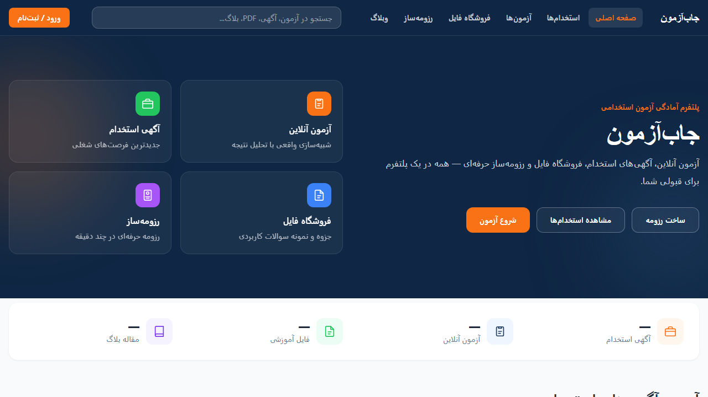
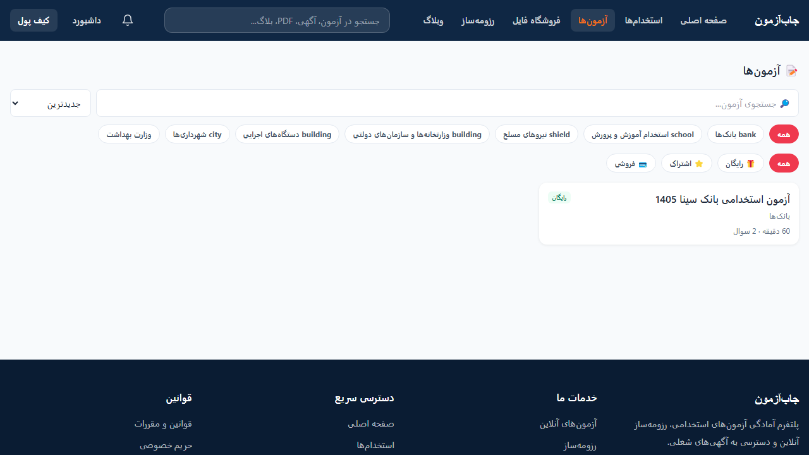
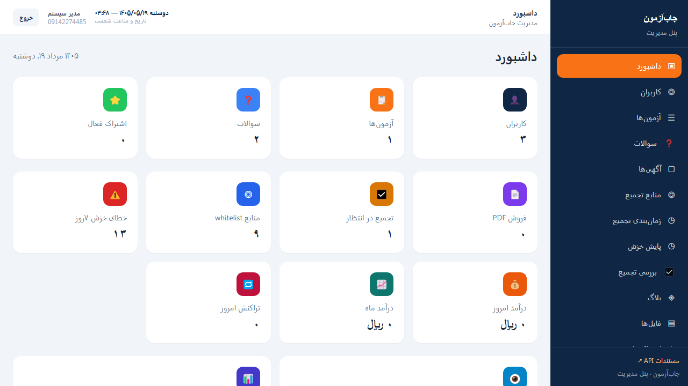
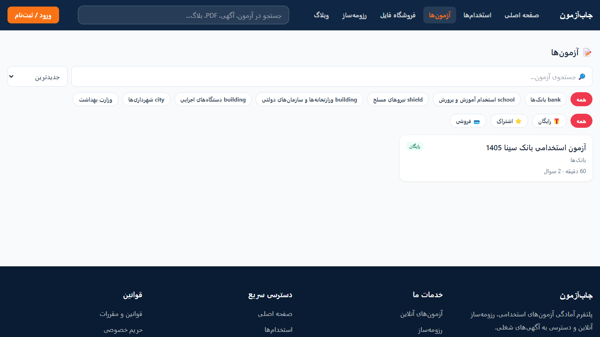
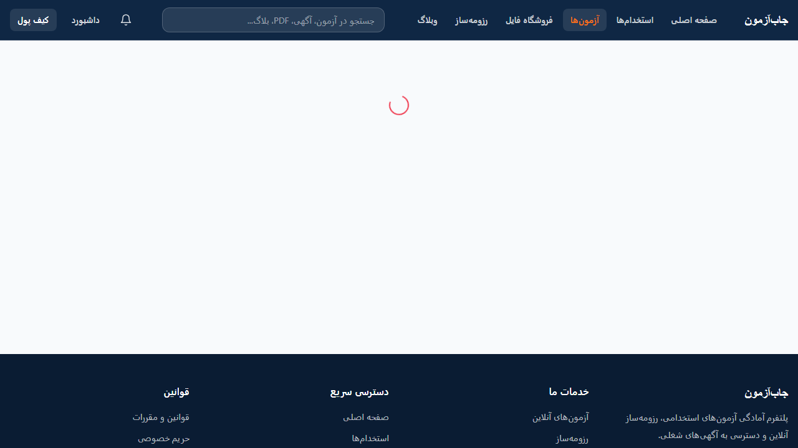
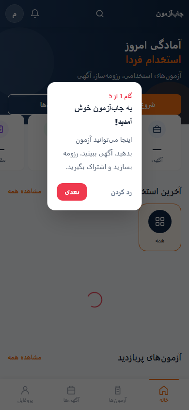
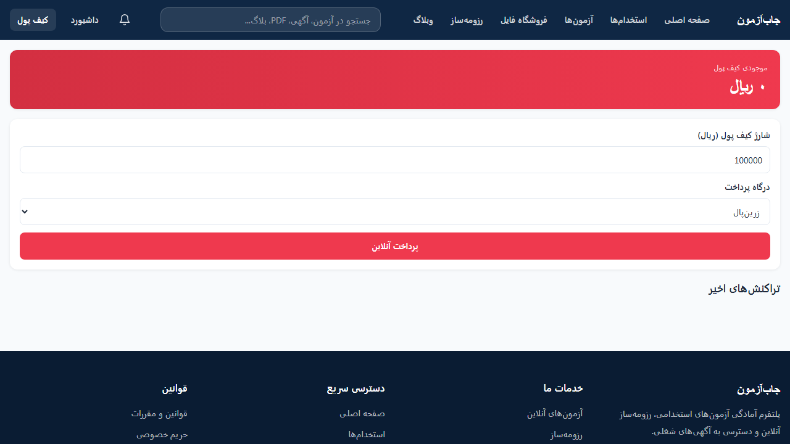
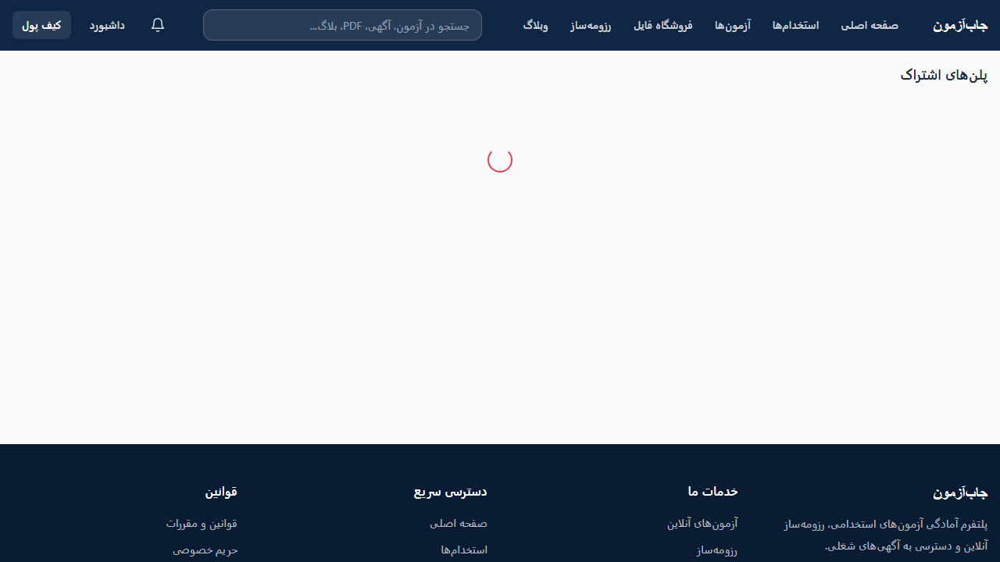
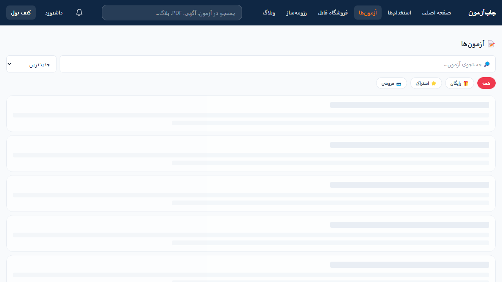

# JobAzmoon (جاب‌آزمون)

<p align="center">
  
  
  
  
  
  
  
  
</p>

پلتفرم فارسی و RTL برای آمادگی آزمون‌های استخدامی، شامل آزمون آنلاین، آگهی استخدام، فروشگاه PDF، اشتراک، کیف پول و پنل ادمین.

---

## معرفی

JobAzmoon یک SPA/PWA است با:

| سطح | تکنولوژی |
|------|-----------|
| Frontend کاربر | Vue 3 + Vite + Pinia + Vue Router + TailwindCSS + PWA |
| Admin SPA | Vue 3 جداگانه در مسیر `/admin` |
| Backend | Laravel 11 + Sanctum + Horizon |
| Admin PHP (اختیاری) | Filament در مسیر `/filament` |

### امکانات کلیدی

- آزمون آنلاین با autosave، نمره‌دهی و لیدربورد
- آگهی استخدام + تجمیع منابع رسمی (صف `crawlers`)
- فروشگاه PDF، اشتراک، کیف پول و درگاه زرین‌پال (verify ایدمپوتنت)
- رزومه‌ساز با AI Suggest، تیکت، کوپن، وبلاگ، بنر و صفحات ثابت
- Feature flags (`features` + Filament + `GET /api/v1/features`)
- مانیتورینگ: Sentry، Horizon، Telescope، گزارش CSP

### اسکرین‌شات

| صفحه اصلی | آزمون | پنل ادمین |
|-----------|--------|-----------|
|  |  |  |

| لیست آزمون | نتیجه | موبایل |
|------------|--------|--------|
|  |  |  |

| کیف پول | اشتراک | شروع آزمون |
|---------|--------|------------|
|  |  |  |

راهنما و اسکریپت: [`docs/screenshots/README.md`](docs/screenshots/README.md) و `npm run screenshots`

## 🚀 شروع سریع

```bash
# ۱. کلون
git clone https://github.com/davaj841-tech/job-kimi.git
cd job-kimi

# ۲. وابستگی‌ها
composer install
npm install

# ۳. تنظیمات
cp .env.example .env
php artisan key:generate
# .env را ویرایش کن (DB, Redis, Zarinpal, ...)

# ۴. دیتابیس
php artisan migrate --seed

# ۵. بیلد
npm run build

# ۶. توسعه
composer run dev
```

یا یک‌فرمان:

```bash
./scripts/setup.sh
```

---

## نیازمندی‌ها

- PHP 8.2+ (توصیه: 8.3)
- Composer 2
- Node.js 18+ و npm
- MySQL 8 / MariaDB یا SQLite (لوکال)
- Redis (توصیه برای production: queue / cache / session / Horizon)
- پسوندهای PHP: intl, gd, mbstring, pdo, tokenizer, xml, curl, zip, bcmath

---

## نصب (لوکال)

```bash
git clone https://github.com/davaj841-tech/job-kimi.git
cd job-kimi

composer install
cp .env.example .env
php artisan key:generate

# تنظیم DB_* در .env
php artisan migrate --seed
php artisan storage:link

npm install
npm run build
```

### توسعه (hot reload)

```bash
composer run dev
```

همزمان: Laravel Serve + Queue Worker + Logs + Vite

### کرون و صف

```bash
* * * * * cd /path/to/project && php artisan schedule:run >> /dev/null 2>&1

php artisan queue:work --queue=crawlers,default --timeout=150
# یا با Redis:
php artisan horizon
```

---

## ساختار پروژه

```
job-kimi/
├── .github/workflows/ci.yml
├── app/                    # Actions, Controllers, Filament, Services, …
├── docs/
│   ├── PERFORMANCE.md      # ایندکس‌ها و نکات پرفورمنس
│   ├── MONITORING_CHECKLIST.md
│   ├── PRODUCTION_CHECKLIST.md
│   ├── STAGING_CHECKLIST.md
│   ├── GITHUB_PROTECTION.md
│   └── screenshots/
├── resources/js/           # Vue SPA کاربر + admin + PWA
├── routes/api/*.php
├── scripts/backup.sh
├── scripts/restore.sh
├── BACKUP-RESTORE.md       # RTO 4h / RPO 24h — بکاپ و بازیابی
├── tests/
└── README.md
```

---

## تکنولوژی‌ها

| Backend | Frontend |
|---------|----------|
| Laravel 11 | Vue 3.5 + Composition API |
| Sanctum | Vite 6 |
| Filament 3 | Pinia 2 |
| Horizon | Vue Router 4 |
| Telescope (اختیاری) | TailwindCSS 3 |
| Scribe (API docs) | Chart.js / KaTeX |
| Spatie Permission & MediaLibrary | vite-plugin-pwa |
| DomPDF / Maatwebsite Excel | Vitest + Testing Library |
| Sentry (PHP + Vue) | ESLint + Prettier |
| Predis | @vueuse/core |

---

## API

پایه: `/api/v1`

### مستندات (Scribe)

| نوع | مسیر |
|-----|------|
| UI | [`/api/documentation`](/api/documentation) |
| OpenAPI | [`/api/documentation.openapi`](/api/documentation.openapi) |

بازتولید بعد از تغییر کنترلرها:

```bash
php artisan scribe:generate
```

### نمونه درخواست‌ها

```http
POST /api/v1/auth/otp/send
Content-Type: application/json

{ "mobile": "09123456789" }
```

```http
GET /api/v1/exams
```

```http
POST /api/v1/exams/123/start
Authorization: Bearer {token}
```

```http
GET /api/v1/features
```

مسیرهای callback زرین‌پال (`/wallet/verify`, `/subscription/verify`) public هستند و نیاز به token ندارند. مسیرها در `routes/api/*.php` تقسیم شده‌اند.

---

## پنل‌های ادمین

| مسیر | نوع | کاربرد |
|------|-----|--------|
| `/admin` | Vue SPA | پنل عملیاتی |
| `/filament` | Filament | منابع PHP (از جمله Feature flags) |
| `/horizon` | Horizon | مانیتور صف (نیاز به auth) |
| `/telescope` | Telescope | دیباگ (اگر `TELESCOPE_ENABLED=true`) |

---

## متغیرهای محیطی کلیدی

| متغیر | توضیح |
|-------|-------|
| `APP_URL` | آدرس سایت |
| `QUEUE_CONNECTION` / `CACHE_STORE` / `SESSION_DRIVER` | در prod: `redis` |
| `REDIS_CLIENT` | معمولاً `predis` |
| `ZARINPAL_MERCHANT_ID` / `ZARINPAL_SANDBOX` | درگاه پرداخت |
| `KAVENEGAR_API_KEY` | OTP SMS |
| `OPENAI_API_KEY` | رزومه AI |
| `TURNSTILE_*` | Cloudflare Turnstile |
| `SENTRY_LARAVEL_DSN` / `VITE_SENTRY_DSN` | Sentry |
| `BACKUP_S3_URI` / `BACKUP_KEEP_DAYS` | بکاپ off-site |
| `DEPLOY_SECRET` | bypass هنگام `artisan down` |
| `TELESCOPE_ENABLED` | روشن/خاموش Telescope |
| `FILAMENT_PATH` | مسیر Filament |

---

## توسعه و کیفیت کد

```bash
php artisan test
npm run test:unit
npm run lint && npm run type-check
./vendor/bin/pint --test
./vendor/bin/phpstan analyse --no-progress
npm run build
```

CI: `.github/workflows/ci.yml` (PHP tests + Pint/PHPStan + Vite build + Scribe generate).

---

## Deploy

راهنمای فارسی هاست (Document Root، اشتراکی/VPS، چک‌لیست): [`docs/HOSTING.md`](docs/HOSTING.md)  
جزئیات سرور: [`deploy/README.md`](deploy/README.md)

فقط اسکریپت `./deploy.sh` روی Linux VPS است (از Windows/Laragon اجرا نمی‌شود):

```bash
# Staging
./deploy.sh staging

# Production (maintenance → backup → migrate → cache → Horizon → up)
DEPLOY_SECRET='your-secret-key' ./deploy.sh production
```

چک‌لیست‌ها:

- [`docs/HOSTING.md`](docs/HOSTING.md) — آماده‌سازی هاست
- [`docs/PRODUCTION_CHECKLIST.md`](docs/PRODUCTION_CHECKLIST.md)
- [`docs/STAGING_CHECKLIST.md`](docs/STAGING_CHECKLIST.md)
- [`docs/MONITORING_CHECKLIST.md`](docs/MONITORING_CHECKLIST.md) — Sentry / Horizon / Telescope / CF / CSP / Zarinpal
- [`BACKUP-RESTORE.md`](BACKUP-RESTORE.md) — RTO 4h / RPO 24h
- [`docs/PERFORMANCE.md`](docs/PERFORMANCE.md)

Health: `GET /health` و `GET /up`

---

## امنیت

- Secretها فقط در `.env`
- Trust Proxies (Cloudflare CIDR) — XFF از peer غیرقابل‌اعتماد نادیده گرفته می‌شود
- CSP + گزارش به `storage/logs/csp-violations.log`
- Turnstile روی auth
- پرداخت: کلید ایدمپوتنسی روی verify
- Crawler فقط دامنه‌های تأییدشده (SSRF Guard)
- Sanctum + Spatie Permission

---

## مستندات بیشتر

| سند | موضوع |
|-----|--------|
| [HOSTING.md](docs/HOSTING.md) | استقرار روی هاست / VPS |
| [QUESTIONS_IMPORT.md](docs/QUESTIONS_IMPORT.md) | ورود گروهی سوالات آزمون |
| [BACKUP-RESTORE.md](BACKUP-RESTORE.md) | بکاپ و بازیابی |
| [PERFORMANCE.md](docs/PERFORMANCE.md) | ایندکس و پرفورمنس |
| [MONITORING_CHECKLIST.md](docs/MONITORING_CHECKLIST.md) | مانیتورینگ بعد از deploy |
| [GITHUB_PROTECTION.md](docs/GITHUB_PROTECTION.md) | محافظت branch |
| [RELEASING.md](docs/RELEASING.md) | تگ semver و GitHub Release |
| [COMMIT_HISTORY.md](docs/COMMIT_HISTORY.md) | پیام‌های قدیمی commit و سیاست از این به بعد |
| [screenshots/README.md](docs/screenshots/README.md) | تولید اسکرین‌شات |

---

## مجوز

[MIT License](LICENSE)

## مشارکت

1. Branch از `main`: `feature/…` یا `fix/…`
2. `php artisan test` و `npm run test:unit` سبز
3. Pint + PHPStan
4. در صورت تغییر API: `php artisan scribe:generate`
5. بدون breaking change غیرضروری روی `/api/v1/*`
6. Pull Request (قالب: `.github/PULL_REQUEST_TEMPLATE.md`)

### Commit (Conventional Commits)

یک‌بار در کلون محلی:

```bash
git config commit.template .gitmessage
```

یا اسکریپت تعاملی:

```bash
./scripts/commit.sh
```

### Release

```bash
./scripts/release.sh
```

### 🏷️ تگ‌گذاری تاریخی (فقط یک‌بار)

اگر تگ‌های v1.0.0 تا v1.4.0 هنوز push نشده‌اند:

```bash
./scripts/tag-historical.sh --push
```

گزارش باگ: [Issues](https://github.com/davaj841-tech/job-kimi/issues)
